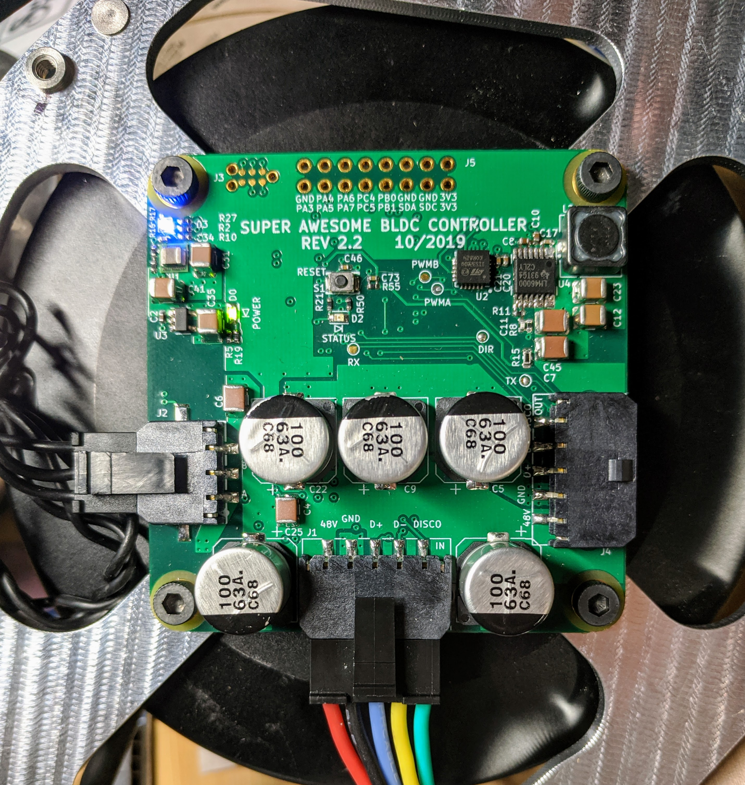
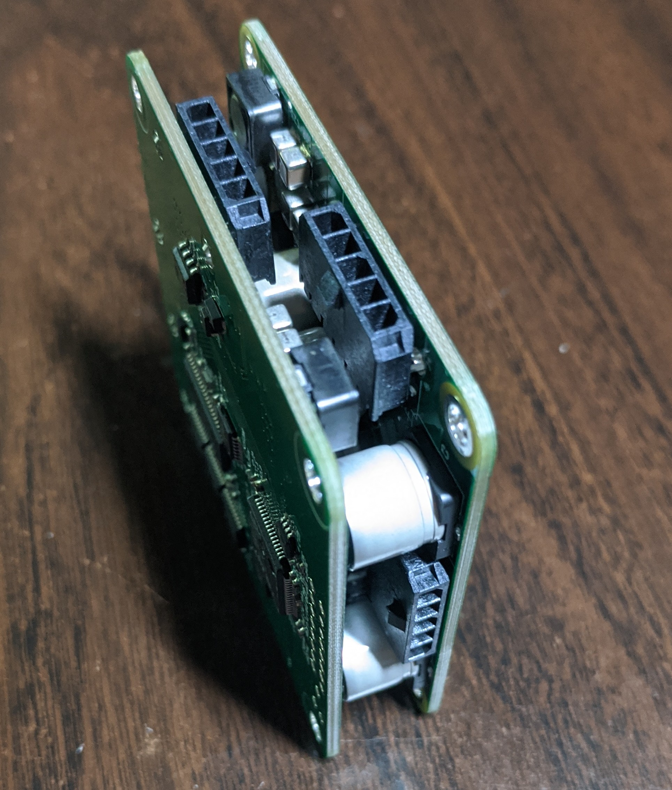

# Betz Drive 
  

  An Open Source Actuator for Robotics Research and Development

## All-In-One

The design of Betz Drive was intended to pursue low-cost motor controllers capable of both running a brushless DC motor and collecting necessary data for controlling a complex robot. As such, the controller contains a variety of devices and sensors built into one board.

* 6-axis IMU
* 3-Phase Current Sense
* On-axis Encoder
* Temperature Sensor

The most unique feature of Betz Drive is the 'disco-bus', a pass-through connector built in which carries power, communications and a special enumeration pin. This system allows quick and easy serial connection of a set of motor controller boards that does not rely on unique identifiers. Each board is serialized on boot and maintains that identification number during operation. In the event of a fault, the identifier is stored in EEPROM which will restore the ID and continue operation.

## Specs

### Power Requirements
* Operating Range (24V - 48V DC)
* Operating Current (3.5A continuous, 6.5A peak)
  * Generally used with high-impedance gimbal motors.
  
### Devices
* Microcontroller (STM32F405)
* Driver (DRV8312)
* Current Sensors (INA253)
* Encoder (AS5047U)
* Temperature Sensor (MCP9808)

### Connectors
* Power [V+, GND]
* Serial over RS485 [D+, D-] (custom protocol)
* Disco Bus [In or Out] (spec)
  * The input is the connection surrounded by capacitors
  
### Dimensions
* Single board: 60mm x 60mm x 13.8mm
* Double stack: 60mm x 60mm x 20mm
* Holes: 52mm separation (square)

## Images

  
  

